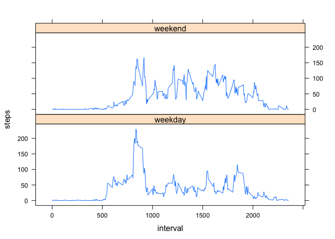

# Reproducible Research: Peer Assessment 1


## Loading and preprocessing the data
Set the working directory and use read.csv to load the data.

```r
setwd("/Users/patrick/R/RepData_PeerAssessment1")
rawdata <- read.csv("activity.csv")
```

Take a look at the variables and see if they're the correct format.

```r
str(rawdata)
```

```
## 'data.frame':	17568 obs. of  3 variables:
##  $ steps   : int  NA NA NA NA NA NA NA NA NA NA ...
##  $ date    : Factor w/ 61 levels "2012-10-01","2012-10-02",..: 1 1 1 1 1 1 1 1 1 1 ...
##  $ interval: int  0 5 10 15 20 25 30 35 40 45 ...
```

We want to convert the "date" column to a Date format with as.Date.


```r
rawdata$date <- as.Date(rawdata$date)
str(rawdata)
```

```
## 'data.frame':	17568 obs. of  3 variables:
##  $ steps   : int  NA NA NA NA NA NA NA NA NA NA ...
##  $ date    : Date, format: "2012-10-01" "2012-10-01" ...
##  $ interval: int  0 5 10 15 20 25 30 35 40 45 ...
```

## What is mean total number of steps taken per day?

Let's aggregate the data to show total steps by day.

```r
dailytotals <- aggregate(steps~date, data= rawdata, sum)
dailytotals
```

```
##          date steps
## 1  2012-10-02   126
## 2  2012-10-03 11352
## 3  2012-10-04 12116
## 4  2012-10-05 13294
## 5  2012-10-06 15420
## 6  2012-10-07 11015
## 7  2012-10-09 12811
## 8  2012-10-10  9900
## 9  2012-10-11 10304
## 10 2012-10-12 17382
## 11 2012-10-13 12426
## 12 2012-10-14 15098
## 13 2012-10-15 10139
## 14 2012-10-16 15084
## 15 2012-10-17 13452
## 16 2012-10-18 10056
## 17 2012-10-19 11829
## 18 2012-10-20 10395
## 19 2012-10-21  8821
## 20 2012-10-22 13460
## 21 2012-10-23  8918
## 22 2012-10-24  8355
## 23 2012-10-25  2492
## 24 2012-10-26  6778
## 25 2012-10-27 10119
## 26 2012-10-28 11458
## 27 2012-10-29  5018
## 28 2012-10-30  9819
## 29 2012-10-31 15414
## 30 2012-11-02 10600
## 31 2012-11-03 10571
## 32 2012-11-05 10439
## 33 2012-11-06  8334
## 34 2012-11-07 12883
## 35 2012-11-08  3219
## 36 2012-11-11 12608
## 37 2012-11-12 10765
## 38 2012-11-13  7336
## 39 2012-11-15    41
## 40 2012-11-16  5441
## 41 2012-11-17 14339
## 42 2012-11-18 15110
## 43 2012-11-19  8841
## 44 2012-11-20  4472
## 45 2012-11-21 12787
## 46 2012-11-22 20427
## 47 2012-11-23 21194
## 48 2012-11-24 14478
## 49 2012-11-25 11834
## 50 2012-11-26 11162
## 51 2012-11-27 13646
## 52 2012-11-28 10183
## 53 2012-11-29  7047
```

Let's plot a histogram of the total steps taken each day.

```r
hist(dailytotals$steps)
```

 

Now let's see what the mean and median steps taken a day are. We will round the mean by coercing it into an intereger. 

```r
meansteps <- as.integer(mean(dailytotals$steps))
mediansteps <- median(dailytotals$steps)
meansteps
```

```
## [1] 10766
```

```r
mediansteps
```

```
## [1] 10765
```

The mean number of steps is 10766 and the median number of steps is 10765.


## What is the average daily activity pattern?

Now let's aggregate to find average steps per interval across all days.

```r
intervalaverages <- aggregate(steps~interval, data= rawdata, mean)
```

Instead of printing the data, let's look at a plot of it.

```r
plot(intervalaverages, type="l")
```

 

And determine the interval that has the highest average number of steps across all days.

```r
intervalaverages[which.max(intervalaverages$steps),]
```

```
##     interval    steps
## 104      835 206.1698
```

## Imputing missing values

Let's figure out how many rows have NAs. 

```r
NArows <- is.na(rawdata$steps)
numNAs <- sum(NArows)
```

There are 2304 rows of data with NAs.

Let's replace those NAs with the mean steps for their interval. We will then round these mean values by using the as.integer function. The new dataset wil be in temprawdata.

```r
tempintervalaverages <- intervalaverages
names(tempintervalaverages)[2] <- "tempsteps"
temprawdata <- merge(rawdata, tempintervalaverages)
temprawdata$steps[is.na(temprawdata$steps)] <- temprawdata$tempsteps[is.na(temprawdata$steps)]
temprawdata$steps <- as.integer(temprawdata$steps)
temprawdata$tempsteps <- NULL
```

Let's aggregate the data to show total steps by day.

```r
tempdailytotals <- aggregate(steps~date, data= temprawdata, sum)
tempdailytotals
```

```
##          date steps
## 1  2012-10-01 10641
## 2  2012-10-02   126
## 3  2012-10-03 11352
## 4  2012-10-04 12116
## 5  2012-10-05 13294
## 6  2012-10-06 15420
## 7  2012-10-07 11015
## 8  2012-10-08 10641
## 9  2012-10-09 12811
## 10 2012-10-10  9900
## 11 2012-10-11 10304
## 12 2012-10-12 17382
## 13 2012-10-13 12426
## 14 2012-10-14 15098
## 15 2012-10-15 10139
## 16 2012-10-16 15084
## 17 2012-10-17 13452
## 18 2012-10-18 10056
## 19 2012-10-19 11829
## 20 2012-10-20 10395
## 21 2012-10-21  8821
## 22 2012-10-22 13460
## 23 2012-10-23  8918
## 24 2012-10-24  8355
## 25 2012-10-25  2492
## 26 2012-10-26  6778
## 27 2012-10-27 10119
## 28 2012-10-28 11458
## 29 2012-10-29  5018
## 30 2012-10-30  9819
## 31 2012-10-31 15414
## 32 2012-11-01 10641
## 33 2012-11-02 10600
## 34 2012-11-03 10571
## 35 2012-11-04 10641
## 36 2012-11-05 10439
## 37 2012-11-06  8334
## 38 2012-11-07 12883
## 39 2012-11-08  3219
## 40 2012-11-09 10641
## 41 2012-11-10 10641
## 42 2012-11-11 12608
## 43 2012-11-12 10765
## 44 2012-11-13  7336
## 45 2012-11-14 10641
## 46 2012-11-15    41
## 47 2012-11-16  5441
## 48 2012-11-17 14339
## 49 2012-11-18 15110
## 50 2012-11-19  8841
## 51 2012-11-20  4472
## 52 2012-11-21 12787
## 53 2012-11-22 20427
## 54 2012-11-23 21194
## 55 2012-11-24 14478
## 56 2012-11-25 11834
## 57 2012-11-26 11162
## 58 2012-11-27 13646
## 59 2012-11-28 10183
## 60 2012-11-29  7047
## 61 2012-11-30 10641
```

Let's plot a histogram of the total steps taken each day.

```r
hist(tempdailytotals$steps)
```

 

Now let's see what the mean and median steps taken a day are. We will round the mean by coercing it into an intereger. 

```r
tempmeansteps <- as.integer(mean(tempdailytotals$steps))
tempmediansteps <- median(tempdailytotals$steps)
tempmeansteps
```

```
## [1] 10749
```

```r
tempmediansteps
```

```
## [1] 10641
```

The mean number of steps is 10749 and the median number of steps is 10641.

This process of imputing the values for NA increased the frequency in the 'middle' bucket and also lowered the mean and median of the data.


## Are there differences in activity patterns between weekdays and weekends?

Let's first make a column to list the days of the week. Then we'll create another column to flag which values are weekdays and which are weekends.

```r
temprawdata$weekdays <- weekdays(temprawdata$date)
temprawdata$daytype <- "weekday"
temprawdata[temprawdata$weekdays %in% c("Saturday","Sunday"), "daytype"] <-"weekend"
```

Now we can aggregate the average number of steps across interval but make the distinction between weekend and weekdays. 

```r
aggbydaytype <- aggregate(steps~interval+daytype, data= temprawdata, mean)
```

Then we can plot the data to observe any differences in average activity patterns between weekends and weekdays.

```r
library(lattice)
xyplot(steps~interval | daytype, data = aggbydaytype, layout=c(1,2), type = "l")
```

 
